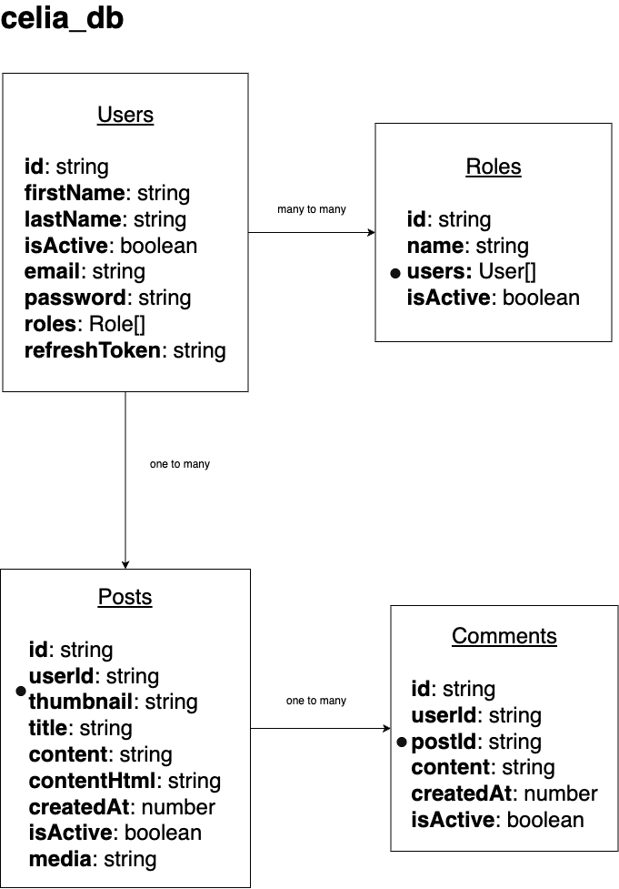

<p align="center">
  <a href="http://nestjs.com/" target="blank"></a>
</p>

[circleci-image]: https://img.shields.io/circleci/build/github/nestjs/nest/master?token=abc123def456
[circleci-url]: https://circleci.com/gh/nestjs/nest

<p align="center">A progressive <a href="http://nodejs.org" target="_blank">Node.js</a> framework for building efficient and scalable server-side applications.</p>
<p align="center">

## TODO:

[x] Boiler plate

[x] Dockerize project

[x] Read envs

[x] Add typeorm

[x] database design

[x] Make database config abstract

[x] Schema validation for request data

[x] use global schema validation

[x] Password encrypt

[x] Serialize response to client

[ ] Add passport lib

[ ] Authorization and authentication guards

[ ] Add rest of modules

[ ] Fix env file for prod on docker-compose

[ ] Add swagger

[ ] Exception filter

[ ] Add interceptor to return an standard response

## Description

[Nest](https://github.com/nestjs/nest) framework TypeScript starter repository.

## Project setup

```bash
$ npm install
```

## Compile and run the project

```bash
# development
$ npm run start

# watch mode
$ npm run start:dev

# production mode
$ npm run start:prod
```

## Run tests

```bash
# unit tests
$ npm run test

# e2e tests
$ npm run test:e2e

# test coverage
$ npm run test:cov
```

## Deployment

When you're ready to deploy your NestJS application to production, there are some key steps you can take to ensure it runs as efficiently as possible. Check out the [deployment documentation](https://docs.nestjs.com/deployment) for more information.

If you are looking for a cloud-based platform to deploy your NestJS application, check out [Mau](https://mau.nestjs.com), our official platform for deploying NestJS applications on AWS. Mau makes deployment straightforward and fast, requiring just a few simple steps:

```bash
$ npm install -g mau
$ mau deploy
```

With Mau, you can deploy your application in just a few clicks, allowing you to focus on building features rather than managing infrastructure.

## Database Design



### Directory Structure

## Setting Up MySQL Permissions

To set up MySQL permissions for the project, follow these steps:

1. **Access the MySQL Container**:
   ```sh
   docker exec -it <mysql_container_name> mysql -u root -p
   ```
   Replace <mysql_container_name> with the name of your MySQL container. You will be prompted to enter the root password.

2. Create the Database: Create the database if it does not already exist:
    ```sh
    CREATE DATABASE IF NOT EXISTS celia_db;
    ```

3. Create the User: Create the user if it does not already exist:
    ```sh
    CREATE USER IF NOT EXISTS 'testuser'@'%' IDENTIFIED BY <password>;
    ```

4. Grant Permissions: Grant all privileges on the celia_db database to the testuser:
    ```sh
    GRANT ALL PRIVILEGES ON celia_db.* TO 'testuser'@'%';
    ```

5. Flush Privileges: Apply the changes by flushing the privileges:
    ```sh
    FLUSH PRIVILEGES;
    ```

6. Exit the MySQL Shell: Exit the MySQL shell by typing:
    ```sh
    EXIT;
    ```

